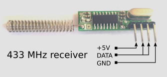
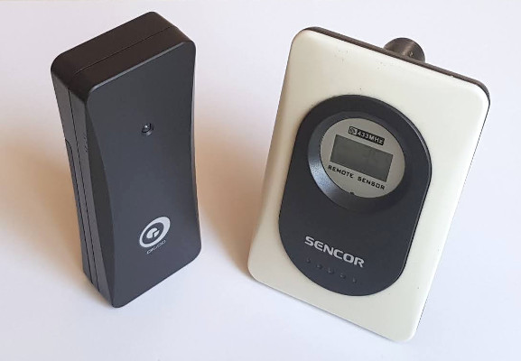
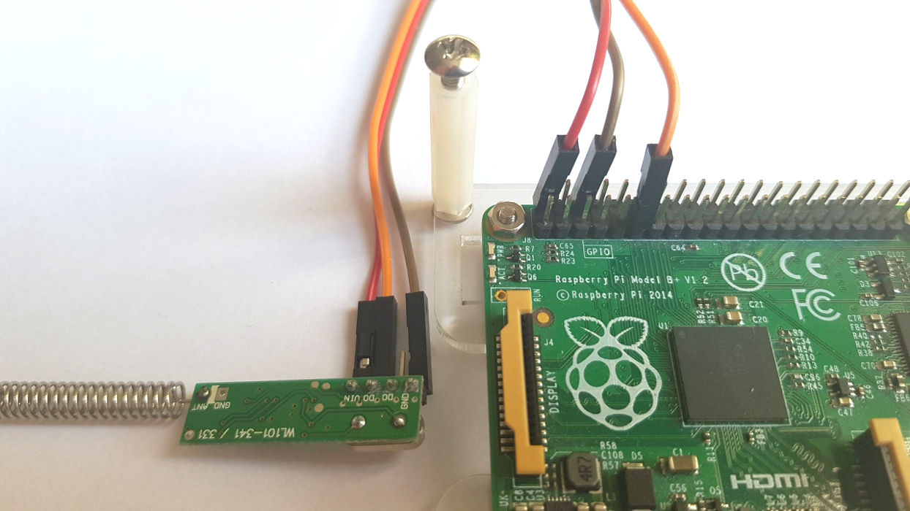

# Introduction
This program can read data from cheap 433 MHz wireless temperature and humidity sensors
and integrate with home automation systems using MQTT broker.
It was designed to work with popular ARM boards like Raspberry Pi, Orange Pi, and many others.
Home Assistant MQTT sensor discovery is available.

To make it work you need only one external component &ndash; 433 MHz receiver.
It has to be connected to one of the I/O pins, the program can decode directly
data from sensors without any third-party additional components.
It supports Nexus sensor protocol which is implemented in many cheap sensors.

## Features

* **Works on popular ARM Linux boards**
* **Only 1 EUR external part required**
* **Supports 5 EUR cheap Temperature and Humidity sensors**
* **Tracks sensor connection quality**
* **Reports sensor online and offline status**
* **Seamless integration with Home Assistant**
* **Easy integration with MQTT home automation systems**
* **Many configuration options**

## Applications

* **Home automation**
* **Temperature monitoring**
* **433 MHz to MQTT gateway**
* **433 MHz sensor diagnostics**

### License

This program is free software: you can redistribute it and/or modify
it under the terms of the GNU General Public License as published by
the Free Software Foundation, either version 3 of the License, or
(at your option) any later version.


# Hardware

## Supported boards

Any board that can run **Linux** with block device gpiod I/O driver can be used.
That means any board with a modern version of Linux is supported. Specifically:
* **Orange Pi** running Armbian version 5.x. All boards.
* **Raspberry Pi** running Raspbian. All boards.
* Any board running ≥ **Armbian 5**.

## 433 MHz receiver

Any of the cheap and popular receivers can be used. Make sure it is superheterodyne and supports
ASK/OOK modulation. The cost of the receiver is about 1 EUR when ordering directly from China.



## Sensors

There are many vendors that produce temperature sensors compatible with Nexus protocol.
Here are a few that are confirmed to use Nexus protocol:
1. **Digoo DG-R8H** &ndash; Temperature and Humidity sensor. No longer available under Digoo brand.
2. **Sencor SWS 21TS** &ndash; temperature only.
3. **[Explore scientific 1004H](https://amzn.eu/d/fYtivE5)**. Temperature and Humidity sensor. Cost 14 EUR.
4. **Clas Ohlson**



# Nexus protocol

A device sends every minute or so (Sencor every 58 seconds, Digoo every 80 seconds) 12 data frames.

Each data frame consists of 36 bits. There is no checksum.

The meaning of bits:

| Bits    | 8   | 1       | 1   | 2       | 12          | 4    | 8        |
|---------|-----|---------|-----|---------|-------------|------|----------|
| Meaning | ID  | Battery | 0   | Channel | Temperature | 1111 | Humidity |

1. *ID* &ndash; unique ID; Sencor generates a new ID when the battery is changed, Digoo keeps the same ID all the time.
2. *Battery* &ndash; low battery indicator; 1 &ndash; battery ok, 0 &ndash; low battery
3. *Channel* &ndash; channel number, 0 &ndash; first channel, 1 &ndash; second and so on.
4. *Temperature* &ndash; signed temperature in Celsius degrees.
5. *Humidity* &ndash; humidity

Every bit starts with 500 µs high pulse. The length of the following low
state decides if this is `1` (2000 µs) or `0` (1000 µs).
There is a 4000 µs long low state period before every 36 bits.


# How it works

The program is written in C++. It supports the new block device GPIO subsystem. It uses [libgpiod](https://git.kernel.org/pub/scm/libs/libgpiod/libgpiod.git/)
C library for I/O operations. For MQTT communication Mosquitto client [libmosquittpp](https://mosquitto.org/man/libmosquitto-3.html) is linked.
INI file parsing with the help of https://github.com/jtilly/inih.

One input pin is used to read data from 433 MHz receiver. Any pin can be used for this operation.
There is *no* requirement the pin supports events.

The state of the pin is probed to detect valid frames. When 36 bits are read the data is converted to
JSON and pushed to MQTT broker. In addition, the program tracks when a new transmitter is detected and when the transmitter becomes silent. This information is also pushed to MQTT.

New transmitters can be automatically detected by the popular home automation system [Home Assistant](https://www.home-assistant.io/).

## Standard operations

Nexus protocol does not offer any way to check if the frame was received properly. The software accepts data from the sensor only when the minimum 2 valid frames were received. A valid frame is when temperature and humidity values are reasonable
and fixed 4 bits are set to 1.

All sensor data is sent as one JSON package in topic `nexus433/sensor/XXXX/state` when XXXX is a unique
transmitter ID made of MAC address, ID (first byte), and channel number (second byte) in hex format.
For example `ae01` means transmitter with id `0xAE` and channel 2 (channels are 0 based).

In addition, when the transmitter first sends data program sends `online` on topic `nexus433/sensor/XXXX/connection`.
If there is no data from the sensor for 90 seconds, the program sends `offline` to the same topic.

When the program starts and stops it sends `online` or `offline` to the global connection topic: `nexus433/[MAC]/connection`.

For newly detected transmitters specially formatted JSON data is sent to `homeassistant` topic to make
Home Assistant automatically discovers the sensor. For one transmitter 4 sensors are created: temperature,
humidity, battery, and quality.

Battery value is either 100 (normal) or 0 (low). These values are compatible with Home Assistant battery class.
They can be changed in the configuration file.

Quality is the percentage of received frames. 100% is when all 12 frames are received.

## Configuration

### Command line options

| Short | Long&nbsp;&nbsp;&nbsp;&nbsp;&nbsp;&nbsp;&nbsp;&nbsp;&nbsp;&nbsp;&nbsp;&nbsp;&nbsp; | Description                                                                                                                                                          |
|-------|------------------------------------------------------------------------------------|----------------------------------------------------------------------------------------------------------------------------------------------------------------------|
|       | `--verbose`                                                                        | Enable verbose mode. More information is printed on the screen.                                                                                                      |
|       | `--daemon`                                                                         | Run in daemon mode. The program works in the background without a console. When verbose mode is on, it will prints messages.                                                 |
| `-g`  | `--config`                                                                         | Path to configuration file. Configuration options from the file got higher priority than command line options. The default config file is `/usr/local/etc/nexus433.ini`.     |
| `-c`  | `--chip`                                                                           | GPIO chip device name, by default `/dev/gpiochip0`.                                                                                                                  |
| `-n`  | `--pin`                                                                            | Pin number to use from specified GPIO chip, default 1. This is not a physical pin number but a number assigned by the block device GPIO. See the discussion below for more info. |
| `-a`  | `--address`                                                                        | MQTT broker host, default `127.0.0.1`.                                                                                                                               |
| `-p`  | `--port`                                                                           | MQTT port number, default `1883`.                                                                                                                                    |
| `-h`  | `--help`                                                                           | Displays help message.                                                                                                                                               |


### Port number and GPIO chip name

Pin numbers are assigned by the block GPIO device driver. To see available lines you can use `gpioinfo` utility from the libgpiod library.

#### Raspberry Pi

Only one GPIO device is available `/dev/gpiochip0`.
Pin numbers are the same as GPIO line numbers, for example, physical pin 11 is `GPIO17`. Pin number for that line is `17`.

#### Orange Pi

Boards based on Allwinner H3 chip got 2 I/O devices:
1. `/dev/gpiochip0` with 223 I/O lines
2. `/dev/gpiochip1` with 32 I/O lines

Port PA lines are assigned to 0&ndash;7, PBB to 8&ndash;15, and so on.
PL port is the first assigned to chip number 2.

### Configuration file

Thanks to the configuration file you can alter the way the program behaves. The file is a typical INI file
divided into sections. Every section got its configuration keys.

By default, the program tries to open `/usr/local/etc/nexus433.ini` file. This location can be changed using `-g/--config`
command line option.

Strings must be entered without `"` characters. Boolean values accepted: `true`/`false`, `yes`/`no`, `1`/`0`.
Comments must begin with `;`.

#### `[transmitter]`

| Key                | Type   | Default       | Description                                                                                |
|--------------------|--------|---------------|--------------------------------------------------------------------------------------------|
| `silent_timeout`   | number | 90            | When no data is received during this time in seconds, transmitters are treated as offline. |
| `minimum_frames`   | number | 2             | Minimum number of data frames to accept transmission as valid.                             |_
| `battery_normal`   | string | 100           | String sent in JSON MQTT message when the battery level is normal.                         |
| `battery_low`      | string | 0             | String sent in JSON MQTT message when the battery level is low.                            |
| `discovery`        | bool   | false         | Enable or disable Home Assistant MQTT sensor discovery.                                    |
| `discovery_prefix` | string | homeassistant | Home Assistant MQTT discovery topic.                                                       |

#### `[receiver]`

| Key             | Type   | Default        | Description                                                                                |
|-----------------|--------|----------------|--------------------------------------------------------------------------------------------|
| `chip`          | string | /dev/gpiochip0 | GPIO device                                                                                |
| `pin`           | number | 1              | I/O pin number                                                                             |
| `resolution_us` | number | 1              | decoder resolution in microseconds. Lower is better but a higher system load.                |
| `tolerance_us`  | number | 300            | ± tolerance of pulse length in microseconds.                                               |
| `internal_led`  | string |                | LED device name from `/sys/class/leds` used to indicate new readings; disabled by default. |

#### `[mqtt]`

| Key        | Type   | Default                                                                                                        | Description                                                                                                                        |
|------------|--------|----------------------------------------------------------------------------------------------------------------|------------------------------------------------------------------------------------------------------------------------------------|
| `host`     | string | 127.0.0.1                                                                                                      | MQTT hostname.                                                                                                                    |
| `port`     | string | 1883                                                                                                           | MQTT port number.                                                                                                                  |
| `user`     | string | MQTT user name.                                                                                                |                                                                                                                                    |
| `clientid` | string | nexus433                                                                                                       | MQTT client id. If more than one instance of the program is connected to the same MQTT broker, use a different ID for each client. |
| `password` | string | MQTT password.                                                                                                 |
| `cafile`   | string | Path to a file containing the PEM encoded trusted CA certificate files.                                        |
| `capath`   | string | Path to a directory containing the PEM encoded trusted CA certificate files.                                   |
| `certfile` | string | Path to a file containing the PEM encoded certificate file.                                                    |
| `keyfile`  | string | Path to a file containing the PEM encoded private key. If encrypted, the password must be passed in `keypass`. |
| `keypass`  | string | Password to encrypted `keyfile`.                                                                               |

##### SSL/TLS support

To enable SSL/TLS encrypted connection to MQTT broker, specify CA certificate and optionally client certificate.

For CA certificate, one of two options must be set: `capath` or `cafile`.
For `capath` to work correctly, the certificate files must have `.pem` as the extension, and you must run `openssl rehash <path to capath>` each time you add or remove a certificate.

If `capath` or `cafile` is specified without any other SSL/TLS option the client will verify Mosquitto server but the server will be unable to verify the client.
The connection will be encrypted.

To specify a client certificate set `certfile`, `keyfile` and optionally `keypass`.

>:information_source: Please note that the traffic to MQTT broker would be encrypted but temperate and humidity data from sensors is available for everyone as radio transmission is not encrypted in any way.

#### `[ignore]`

List of transmitter IDs (2 bytes, ID, and channel number) to be ignored. Data from ignored
transmitters are not sent to MQTT.

The key must be 2 byte ID and the value is true if the transmitter is ignored, otherwise false.
For example to ignore transmitter 0xAE on channel 1 add:
`ae00=true`.

#### `[substitute]`

This section allows changing the original ID of the transmitter to another number. This may be useful
when the sensors are broken or the battery was changed, and you do not want to reconfigure existing infrastructure.

The key must be an ID of the transmitted and the value new ID.
For example, to change 0xAE channel 1 to 0x78 channel 2 use: `ae00=7801`.

#### `[temperature]`

Name of the temperature sensor reported to Home Assistant discovery mechanism for the specified transmitter.
The key must be 2 bytes ID, and the value is the name, for example:
`ae00=Kitchen Temperature`
If not specified the default value of `Temperature Id:XX ch Y` will be reported.

#### `[humidity]`

Name of the humidity sensor reported to Home Assistant discovery mechanism for the specified transmitter.
Key must be 2 bytes ID, the value is the name, for example:
`ae00=Kitchen Humidity`
If not specified the default value of `Humidity Id:XX ch Y` will be reported.

#### `[battery]`

Name of the battery sensor reported to Home Assistant discovery mechanism for the specified transmitter.
The key must be 2 bytes ID, and the value is the name, for example:
`ae00=Kitchen Sensor Battery`
If not specified, the default value of `Battery Id:XX ch Y` will be reported.

#### `[quality]`

Name of the quality sensor reported to Home Assistant discovery mechanism for the specified transmitter.
Key must be 2 bytes ID, the value is the name, for example:
`ae00=Kitchen Sensor Connection Quality`
If not specified the default value of `Quality Id:XX ch Y` will be reported.

# Installation using the Debian package

Download the appropriate package. Check the board name and platform. _armhf_ means 32-bit ARM platform (not RPI4).

## Verify package signature

This step is optional but highly recommended. First download the signing key from a key server (only once).
You need `gpg` installed (`sudo apt install gpg`).
```bash
gpg --keyserver pgp.mit.edu --recv-key 9E4441F6F3B07930
```

Now install the tool to verify Debian packages.
```bash
sudo apt install dpkg-sig
```

and finally, verify the signature
```bash
dpkg-sig --verify nexus433_1.0.2-raspberrypi_armhf.deb
```

You should see `GOODSIG` if the signature is valid (the rest of the numbers may differ). That means the package was not altered and was created by nexus433 maintainer.
```
Processing nexus433_1.0.2-raspberrypi_armhf.deb...
GOODSIG _gpgbuilder 513D72E653874FC357849F759E4441F6F3B07930 1613422321
```

Now install package

```bash
sudo apt install ./nexus433_1.0.2-raspberrypi_armhf.deb
```

After installation, change the name of `nexus433.ini.example` to `nexus.ini` and edit options.
For distribution packages ≤ v1.1.0 configuration file is located in `/etc`, in later versions in `/usr/local/etc`.

# Manual build and installation

The build system is based on CMake.

Install CMake
```bash
sudo apt install -y cmake
```

Install the mosquitto C++ library
```bash
sudo apt install -y libmosquittopp-dev
```

Install libgpiod C library
```bash
sudo apt install -y libgpiod-dev
```

Clone git repository:
```bash
git clone https://github.com/aquaticus/nexus433
```

### Build

First call CMake, you do it once.
```bash
mkdir release
cd release
cmake ../nexus433 -DCMAKE_BUILD_TYPE=RELEASE
```

Now build
```bash
make -j
```

and install
```bash
sudo make install
```
If the default build configuration files are located:
1. `nexus433` in `/usr/local/bin`
2. `nexus433.ini.example` in `/usr/local/etc`
3. `nexus433.service` in `/usr/local/lib/systemd/system/`

You must change the name of `nexus433.ini.example` to `nexus.ini` and fine-tune the options after installation.

## Build options

Every time you change something in the source code you must call `make` (no need to execute `cmake`).

The build may be optionally modified by passing arguments to `cmake`.
For example to change the default name of the configuration file, call `cmake ../nexus433 -DINSTALL_INI_FILENAME=my.ini`.

List of useful build parameters:

| Name                      | Description                                                                            |
|---------------------------|----------------------------------------------------------------------------------------|
| `INSTALL_INI_DIR`         | Directory where the configuration file is stored, default `/usr/local/etc`             |
| `INSTALL_INI_FILENAME`    | Configuration file name, default `nexus433.ini`                                        |
| `GPIOD_DEFAULT_DEVICE`    | Default gpiod device name where 433MHz receiver is connected, default `/dev/gpiochip0` |
| `GPIOD_DEFAULT_PIN`       | Default pin number name where 433MHz receiver is connected, default `1`                |
| `CMAKE_BUILD_TYPE`        | Build type: `DEBUG`, `RELEASE`, `RELWITHDEBINFO`, `MINSIZEREL`                         |
| `CMAKE_INSTALL_PREFIX`    | Install prefix, default `/usr/local`                                                   |
| `ENABLE_FAKE_TRANSMITTER` | Enable simulated transmitters. Useful for development.                               |

By default, the build script detects the board type and sets `GPIOD_DEFAULT_PIN`. This selects a pin when no configuration is
available or pin was not set by -p/--pin option.

Currently, Raspberry Pi and Orange Pi boards are recognized. These parameters can be easily overridden in the configuration INI file, so no problem when the board is unrecognized.
When the project is cross-compiled it may be useful to force board type by passing to `cmake` `-DBOARD=RASPBERRYPI` or `-DBOARD=ORANGEPI`.
Even when the target board is set, the executable is still portable as the only board-specific parameter is the default pin number.

## Debugging

To debug the application, first, generate DEBUG configuration and then compile
```bash
mkdir debug
cd debug
cmake ../nexus433 -DCMAKE_BUILD_TYPE=DEBUG
make
```

The above compiles sources (with `DEBUG` macro defined) and generates debug information.

It may be also useful to generate project files for Eclipse (if you use Eclipse for development):
```bash
cmake ../nexus433 -G"Eclipse CDT4 - Unix Makefiles"
```


# Quickstart

433 MHz receiver got typically 3 pins: VIN, GND, and DATA.
For Raspberry Pi and boards with a compatible connector like Orange Pi connect VIN to pin #1 (3.3V), GND to pin #6 (GND)
and data to pin #11    (GPIO17).

| 433 MHz receiver | Raspberry Pi  | Orange Pi   |
|------------------|---------------|-------------|
| `VIN`            | `1` (+3.3V)   | `1` (+3.3V) |
| `GND`            | `6` (GND)     | `6` (GND)   |
| `DATA`           | `11` (GPIO17) | `11` (PA1)  |


>:information_source: Note the image below shows `VIN` connected to 5V, not 3.3V.



## MQTT Broker
Make sure you got any MQTT broker up and running. If not please install
[Mosquitto](https://mosquitto.org/). The examples below assume that MQTT broker is installed on the same machine. If not use `-a` command line option to specify MQTT address and `-p` for a port number if different from default 1883.

## First run

Get your sensor close to the receiver and remove the battery.

Run the program in verbose mode and specify the pin number.

| Raspberry Pi                    | Orange Pi                      |
|---------------------------------|--------------------------------|
| `sudo nexus433 --verbose -n 17` | `sudo nexus433 --verbose -n 1` |

Insert battery &ndash; that way the sensor sends immediately data, and you do not need to wait
(remember sensor sends data about once per minute).
You should see new readings on the screen:
```
Loading configuration from /usr/local/etc/nexus433.ini
Reading data from the 433MHz receiver on /dev/gpiochip0 pin 17.
Decoder resolution: 1 µs; tolerance: 300 µs
Connected to MQTT broker.
New transmitter 0x5c channel 2
0x5c910ff38 Id:0x5c Channel:2 Temperature: 27.1°C Humidity: 56% Battery:1 Frames:12 (100%)
```
The last line is the actual data from the sensor. What is interesting is that all 12 data frames were received.
That means reception is very good.
The next step is to monitor MQTT data. Install mosquitto client:
```bash
sudo apt install mosquitto-clients
```
and use `mosquitto_sub` to subscribe to interesting topics.
```bash
mosquitto_sub -v -t "nexus433/#"
```
Of course, add `-h` and `-P` options if needed to specify MQTT host and port.
You should see:
```
nexus433/sensor/5c01/state { "temperature": 27.3, "humidity": 56, "battery": "100", "quality": 100 }
```
Now lets see what other data is sent to MQTT broker.
Stop both `nexus433` and `mosquitto_sub` by pressing `Control-C`.

Run `mosquitto-sub` first and subscribe to an additional topic:
```bash
mosquitto_sub -v -t "nexus433/#" -t "homeassistant/#"
```
Now run:

| Raspberry Pi                    | Orange Pi                      |
|---------------------------------|--------------------------------|
| `sudo nexus433 --verbose -n 17` | `sudo nexus433 --verbose -n 1` |

and wait for the reading (you can use a battery trick to limit waiting time).
When you receive the first data packets check `mosquitto_sub` output. This time it logged more lines:
```
nexus433/connection offline
nexus433/connection online
nexus433/sensor/5c01/connection online
nexus433/sensor/5c01/state { "temperature": 27.4, "humidity": 56, "battery": "100", "quality": 100 }
```
Note that there are 2 connection topics. When the program starts it publishes `online` message on `nexus433/connection`. When
stops for some reason or connection to MQTT is lost `offline`. Because `offline` is published with *retain* flag
you get this message every time subscribed to this topic. Thanks to this feature when the program is down any client
receives this information.

When a new sensor is detected `online` is published on sensor-specific topic.
The format is `nexus433/sensor/XXXX/connection`, where `XXXX` is 2 bytes sensor ID. When a sensor does not send
any data for 90 seconds (this can be configured) on the very same topic `offline` is published.

## LED

It is possible to use one of the built-in LEDs to indicate new packets. When configured, every time valid data is received LED will be on for 500 ms.

To check available LEDs use: `ls /sys/class/leds`. Depending on your device number and names may differ.
Here is the result for Orange Pi PC board:
```
orangepi:green:pwr   
orangepi:red:status  
```

To use red LED modify `nexus433.ini` configuration file:
```ini
[receiver]
internal_led=orangepi:red:status
```

# Start as a service

`make install` automatically installs service configuration files.
To start the service:
```bash
sudo service nexus433 start
```
To stop
```bash
sudo service nexus433 stop
```
To view service status:
```bash
sudo service nexus433 status
```
To run the service every time the system starts:
```bash
sudo systemctl enable nexus433
```

# Home Assistant integration

[Home Assistant](https://www.home-assistant.io/) is a popular open-source home automation system.
It can automatically discover and configure sensors.

To make this feature work you must first enable MQTT support and enable the discovery feature.
Make sure you add the following lines to your `configuration.yaml`:
```yaml
mqtt:
  discovery: true
```
For more information read this article: https://www.home-assistant.io/docs/mqtt/discovery/

Nexus433 by default support MQTT sensor discovery. To disable it, modify `nexus433.ini`
```ini
[transmitter]
discovery=no
```
Discovered devices can be shown in MQTT integration tab in `Configuration` settings. There will be always one device `Nexus433 433MHz gateway`. It provides just one sensor (disabled by default) `Number of active devices`.

When a 433 MHz sensor is detected a new device will be added `Temperatue Sensor Id:XX ch Y` (XX–Sensor Id, Y–channel). This device provides 4 sensors:
1. Temperature
1. Humidity
1. Battery
1. Quality

In addition, there is one sensor available `Number of active 433 MHz transmitters` that indicates active temperature sensors.

## Adding sensors manually to Home Assistant

When automatic device discovery is disabled, a sensor can be added manually.

To add a new sensor, you must perform the same steps as adding any other MQTT sensor. See https://www.home-assistant.io/components/sensor.mqtt/ for more information.

To create a new humidity sensor add the following lines to your `configuration.yaml` (it is assumed the sensor id is `5c01` and MAC address of the network card is 09815B5331AA):
```yaml
- platform: mqtt
  state_topic: "nexus433/sensor/09815B5331AA_5c01/state"
  name: "Bedroom Humidity"
  expire_after: 90
  unit_of_measurement: '%'
  device_class: humidity
  availability_topic: "nexus433/sensor/09815B5331AA_4c01/connection"
  value_template: "{{ value_json.humidity }}"
```

# Reception problems

If you got problems receiving proper data from sensors you can do one of the following:

1. Check if data is properly received from close range, if not check batter or test with another sensor.
2. Move the antenna to a different position.
3. Reduce `resolution_us` parameter to 0 and increase `tolerance_us`.
4. Use a longer antenna. Just attach a piece of wire. The length of the wire is related to wavelength, you can use: 69cm, 34cm, 17cm, 8cm, and 4cm wires.
5. If you got more than one sensor make sure they transmit data at different times. If two sensors collide remove the battery and insert it again.

# CPU usage

Linux is not a real-time operating system. You never know how much time the scheduler assigns to the application.

If the system is not very busy, the application got enough time to process the entire transmission more or less in real-time. If the system is heavily loaded the program can easily miss transmitted bits.

For now the only solution (but unfortunately not guaranteed 100% success) is to force the system to assign more time for the application:

1. Increase the priority of the app; see `nice` command

2. Change resolution to `0` (CPU usage will raise). Additionally, increase tolerance (but big values can also degrade significantly quality).

3. Run the application on a separate system that is either dedicated to 433MHz reception or does not run too many other apps (but that makes nexus433 quite obsolete because you can use a cheaper dedicated board just for 433MHz).

To solve the problem, a kernel device driver is needed and the entire signal processing should be made there.
